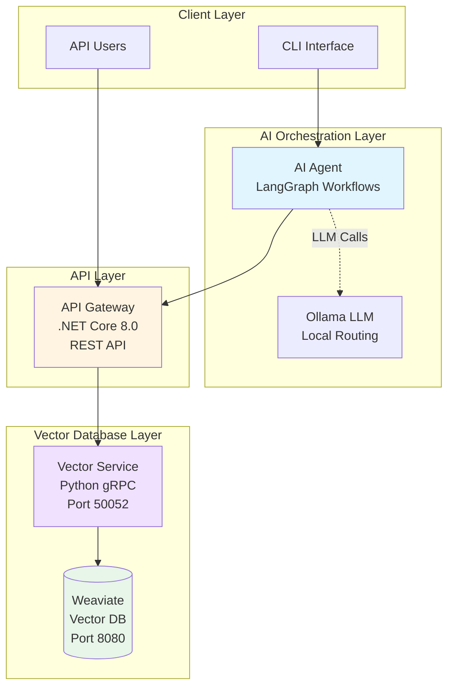
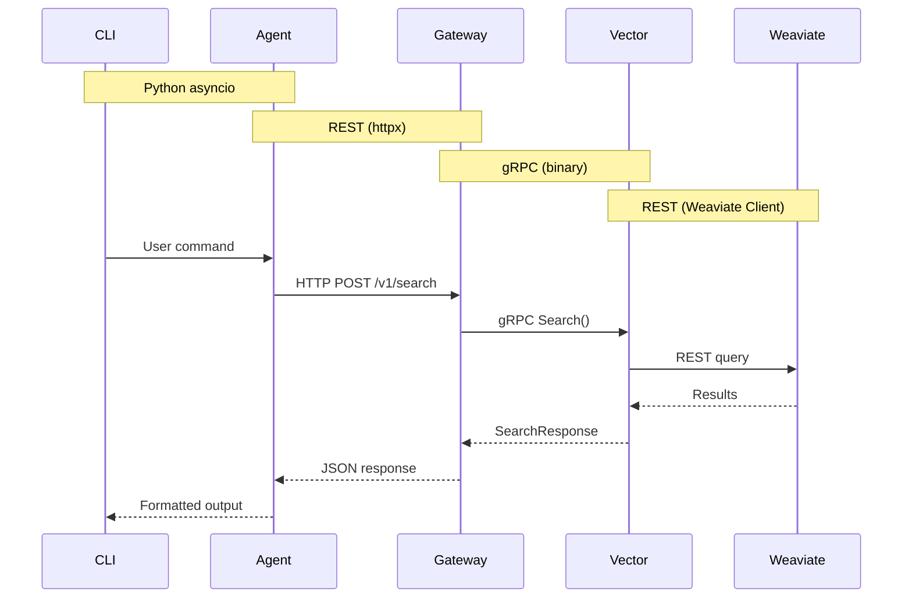
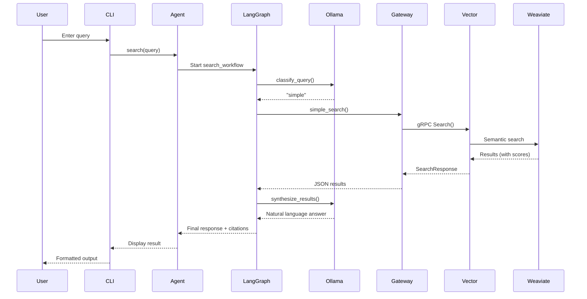
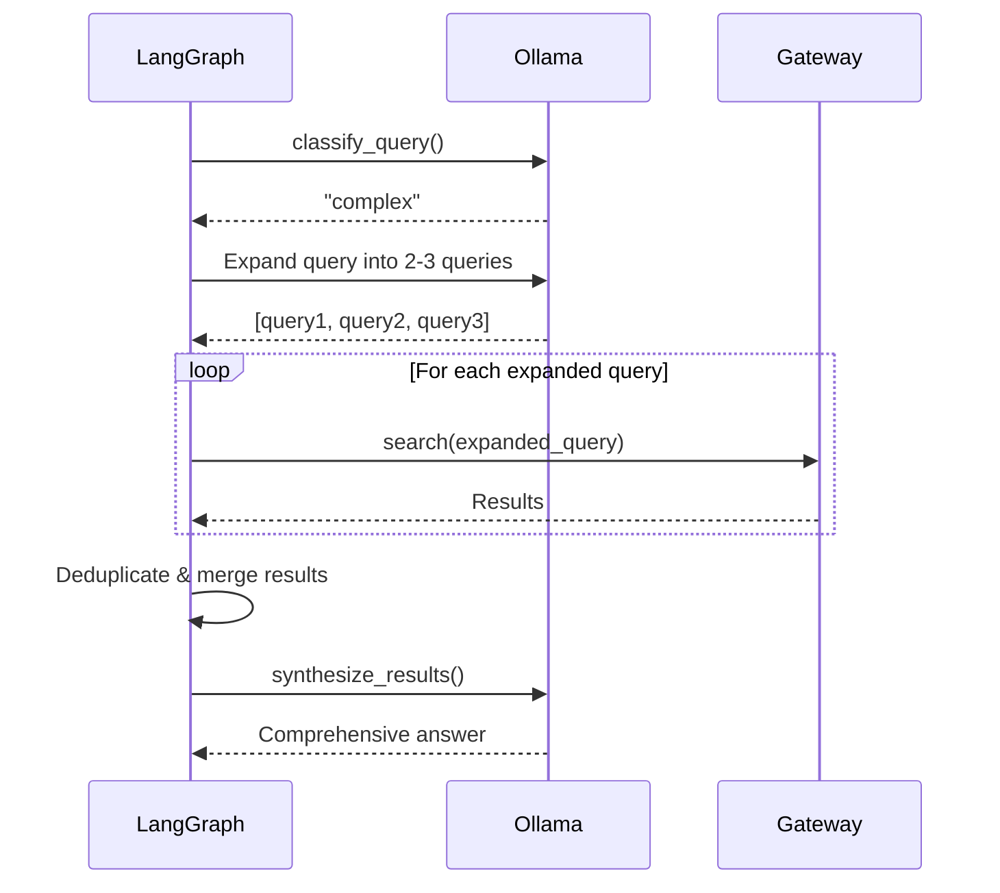
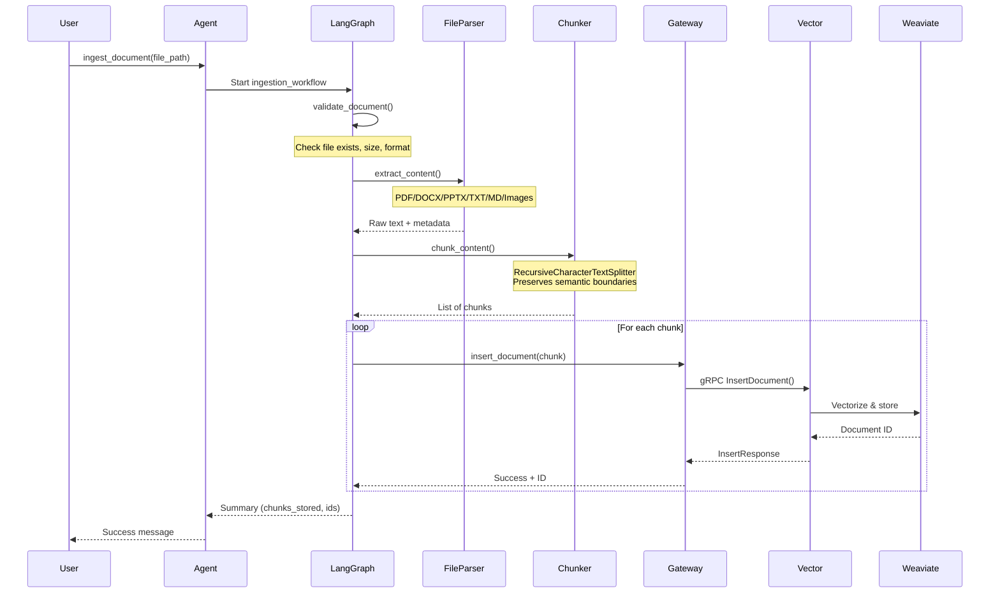
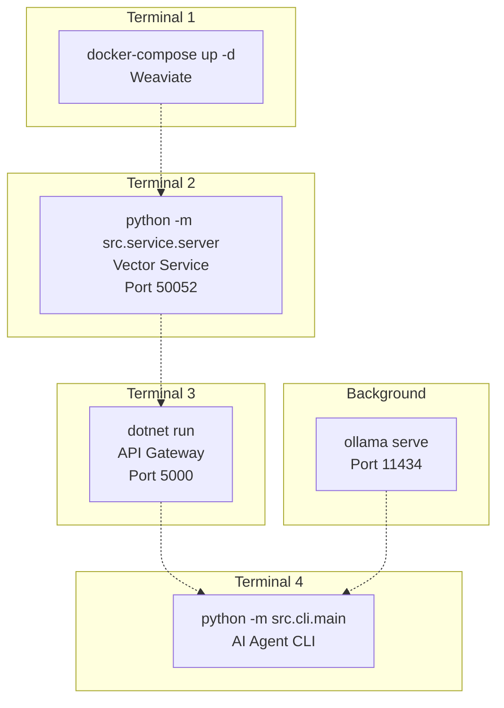

# IntraMind Architecture

> System architecture documentation for the IntraMind AI-powered document search platform

## Table of Contents

1. [System Overview](#system-overview)
2. [Service Architecture](#service-architecture)
3. [Communication Flow](#communication-flow)
4. [Search Request Flow](#search-request-flow)
5. [Document Ingestion Flow](#document-ingestion-flow)
6. [Technology Stack](#technology-stack)
7. [Deployment Architecture](#deployment-architecture)

---

## System Overview

IntraMind is a microservices-based AI platform that enables semantic search across enterprise documents. The system uses a hybrid LLM strategy for cost optimization and employs LangGraph state machines for orchestration.



### Key Design Decisions

1. **Microservices Architecture**: Independent, deployable services with clear boundaries
2. **LangGraph Orchestration**: State machine-based workflow for testability and debuggability
3. **Hybrid LLM Strategy**: Local Ollama for routing (free), cloud LLMs for synthesis (quality)
4. **gRPC Internal Communication**: Efficient binary protocol between API Gateway and Vector Service
5. **REST External API**: Standard HTTP/JSON for client-facing API

---

## Service Architecture

### 1. AI Agent (Python + LangGraph)
**Repository**: `ai-agent/`  
**Technology**: Python 3.11+, LangGraph, LangChain  
**Port**: N/A (library/CLI)

**Responsibilities**:
- Orchestrate AI workflows using LangGraph state machines
- Query classification (simple vs. complex)
- Query expansion for complex searches
- Result synthesis with LLM
- Document ingestion pipeline
- CLI interface for user interaction

**Key Components**:
- `workflows/search_workflow.py` - Search orchestration
- `workflows/ingestion_workflow.py` - Document processing
- `agent/main.py` - IntraMindAgent interface
- `cli/main.py` - Command-line interface
- `tools/api_client.py` - API Gateway client

---

### 2. API Gateway (.NET Core)
**Repository**: `api-gateway/`  
**Technology**: ASP.NET Core 8.0, gRPC Client  
**Port**: 5000 (configurable)

**Responsibilities**:
- REST API endpoints for external clients
- Request validation and error handling
- gRPC client to Vector Service
- Swagger/OpenAPI documentation
- Health checks and monitoring
- Structured logging with Serilog

**Key Endpoints**:
```
POST   /v1/search              - Semantic search
POST   /v1/documents           - Insert document
GET    /v1/documents/{id}      - Retrieve document
POST   /v1/collections         - Create collection
GET    /v1/collections         - List collections
GET    /health                 - Health check
```

---

### 3. Vector Service (Python + gRPC)
**Repository**: `vector-db-service/`  
**Technology**: Python 3.11+, gRPC, Weaviate Client  
**Port**: 50052 (gRPC)

**Responsibilities**:
- gRPC server for vector operations
- Weaviate client wrapper
- Collection/schema management
- Document vectorization and storage
- Semantic search with score filtering
- Metadata extraction and storage

**Key Operations**:
- `CreateCollection` - Schema creation in Weaviate
- `InsertDocument` - Vectorize and store documents
- `Search` - Semantic vector search
- `GetDocument` - Retrieve by ID
- `ListCollections` - Collection enumeration

---

### 4. Weaviate (Vector Database)
**Technology**: Weaviate OSS  
**Port**: 8080 (REST), 50051 (internal gRPC)

**Responsibilities**:
- Vector embeddings storage
- Semantic similarity search
- Schema management
- Data persistence

**Vectorization**:
- **Default**: `text2vec-transformers` (free, local, offline)
- **Optional**: OpenAI embeddings (paid, higher quality)

---

## Communication Flow

### Protocol Overview



### Data Flow Patterns

1. **Synchronous Request/Response**: Search queries
2. **Streaming**: CLI streaming results (future enhancement)
3. **Batch Processing**: Document ingestion with chunking
4. **Error Propagation**: Graceful error handling through all layers

---

## Search Request Flow

### Simple Search (Direct Query)



### Complex Search (Multi-Query Expansion)



**Key Features**:
- **Query Classification**: LLM determines if query is simple or complex
- **Multi-Query Expansion**: Complex queries expanded into 2-3 sub-queries
- **Result Deduplication**: Unique results across all sub-queries
- **Score Filtering**: Optional `min_score` parameter (0.0-1.0)
- **Result Synthesis**: LLM generates natural language answer with citations

---

## Document Ingestion Flow



**Supported File Types**:
- **Documents**: PDF, DOCX, DOC
- **Presentations**: PPTX, PPT
- **Text**: TXT, MD, Markdown
- **Images**: PNG, JPG, JPEG, GIF, BMP (metadata only, OCR-ready)

**Processing Pipeline**:
1. **Validation**: File existence, size limits (100MB), format check
2. **Extraction**: Format-specific parsing with metadata
3. **Chunking**: Semantic splitting (configurable size/overlap)
4. **Storage**: Batch insertion with error handling

**Error Handling**:
- Conditional routing to error handler at each step
- Graceful degradation (partial success reported)
- Comprehensive error messages

---

## Technology Stack

### Programming Languages
- **Python 3.11+**: AI Agent, Vector Service
- **C# (.NET 8.0)**: API Gateway

### Frameworks & Libraries

#### AI/ML Stack
- **LangGraph**: State machine orchestration
- **LangChain**: Tool abstractions and text splitting
- **Ollama**: Local LLM for routing (llama3.2:3b)
- **Anthropic/OpenAI** (optional): Cloud LLMs for synthesis

#### Backend Stack
- **ASP.NET Core 8.0**: API Gateway framework
- **gRPC**: Inter-service communication
- **Protocol Buffers**: Message serialization
- **Weaviate Python Client**: Vector DB client
- **httpx**: Async HTTP client (Python)

#### Data & Storage
- **Weaviate**: Vector database
- **text2vec-transformers**: Local embeddings (free)
- **Docker Volumes**: Data persistence

#### Testing
- **pytest**: Python testing (94 tests)
- **xUnit**: .NET testing
- **Moq**: .NET mocking
- **FluentAssertions**: Assertion library

#### DevOps & Monitoring
- **Docker & Docker Compose**: Containerization
- **Serilog**: Structured logging (.NET)
- **Python logging**: Standard logging (Python)

---

## Deployment Architecture

### Local Development Setup



### Port Mapping
- **8080**: Weaviate REST API
- **50051**: Weaviate internal gRPC
- **50052**: Vector Service gRPC
- **5000**: API Gateway REST API
- **11434**: Ollama LLM

### Environment Variables

**AI Agent** (`.env`):
```bash
API_GATEWAY_URL=http://127.0.0.1:5000
OLLAMA_BASE_URL=http://localhost:11434
# Optional: ANTHROPIC_API_KEY or OPENAI_API_KEY
```

**Vector Service** (`.env`):
```bash
WEAVIATE_URL=http://localhost:8080
GRPC_PORT=50052
```

**API Gateway** (`appsettings.json`):
```json
{
  "VectorService": {
    "Endpoint": "http://localhost:50052"
  }
}
```

### Docker Compose (Weaviate)

```yaml
services:
  weaviate:
    image: semitechnologies/weaviate:latest
    ports:
      - "8080:8080"
      - "50051:50051"
    environment:
      ENABLE_MODULES: text2vec-transformers
      DEFAULT_VECTORIZER_MODULE: text2vec-transformers
      PERSISTENCE_DATA_PATH: /var/lib/weaviate
    volumes:
      - weaviate_data:/var/lib/weaviate
```

### Production Considerations

**Scaling**:
- API Gateway: Stateless, can horizontally scale
- Vector Service: Can scale with load balancing
- Weaviate: Supports clustering for high availability

**Security**:
- Add authentication to API Gateway (JWT/OAuth2)
- Enable Weaviate API keys
- Use HTTPS/TLS for all external endpoints
- Secure gRPC with TLS certificates

**Monitoring**:
- Add Application Insights / Prometheus metrics
- Implement distributed tracing (OpenTelemetry)
- Set up log aggregation (ELK/Loki)
- Health check endpoints for Kubernetes

**Cost Optimization**:
- Use local Ollama for routing: **FREE**
- Weaviate with local transformers: **FREE**
- Optional cloud LLM for synthesis: ~$0.001/query
- **Total estimated cost: ~$1/month for synthesis**

---

## Architecture Principles

### 1. Separation of Concerns
- Each service has a single, well-defined responsibility
- Clear API boundaries between services
- Independent deployment and scaling

### 2. State Machine Design
- Explicit workflow states for observability
- Testable node functions
- Clear routing logic
- Error handling at each step

### 3. Hybrid Cost Optimization
- Free local LLM (Ollama) for lightweight routing
- Cloud LLM only for final synthesis (quality-critical)
- Reduces costs by 80% vs. full cloud LLM approach

### 4. Production Patterns
- Comprehensive error handling
- Structured logging throughout
- Health checks and monitoring
- Extensive test coverage (94 tests)
- Graceful degradation

### 5. Developer Experience
- Type safety (Pydantic, TypeScript-like models)
- Clear documentation
- CLI for rapid testing
- Docker Compose for easy setup

---

## Future Enhancements

### Short Term
- [ ] Implement streaming search results
- [ ] Add caching layer (Redis)
- [ ] Implement rate limiting
- [ ] Add authentication/authorization

### Medium Term
- [ ] OCR for image documents
- [ ] Multi-tenant support
- [ ] Advanced metadata filtering
- [ ] Query history and analytics

### Long Term
- [ ] Kubernetes deployment
- [ ] Multi-language support
- [ ] Real-time document updates
- [ ] Agentic RAG with self-correction

---

## References

- [LangGraph Documentation](https://langchain-ai.github.io/langgraph/)
- [Weaviate Documentation](https://weaviate.io/developers/weaviate)
- [gRPC Documentation](https://grpc.io/docs/)
- [ASP.NET Core Documentation](https://learn.microsoft.com/en-us/aspnet/core/)

---

**Last Updated**: November 4, 2025  
**Version**: 1.0.0  
**Maintained by**: IntraMind Team

